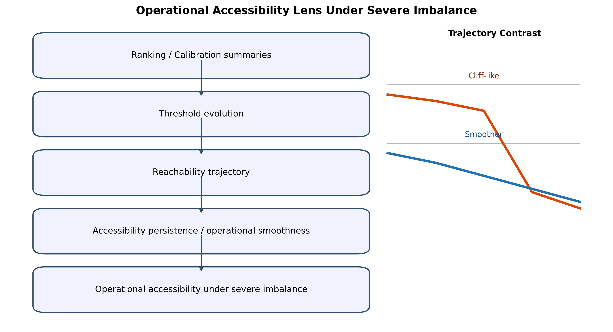
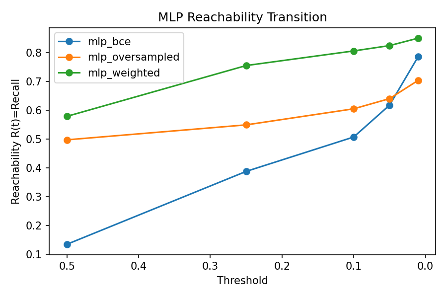
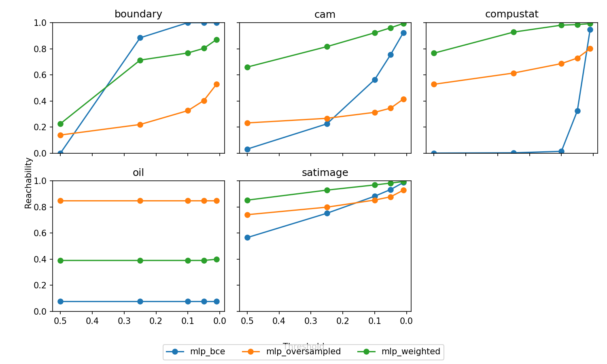
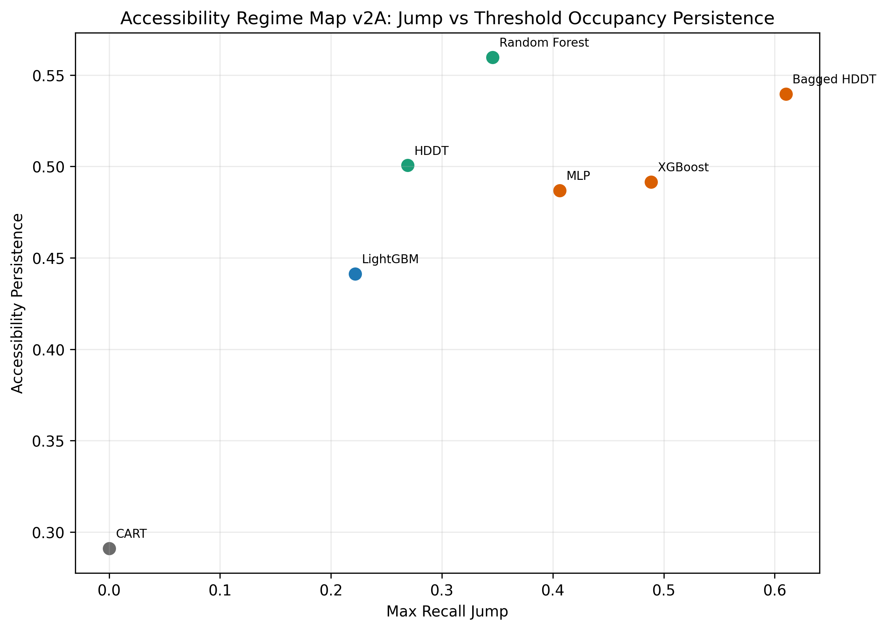
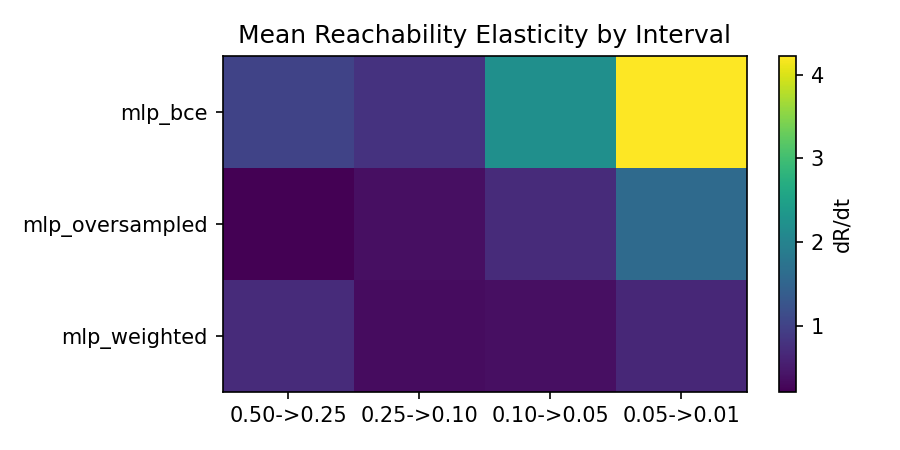
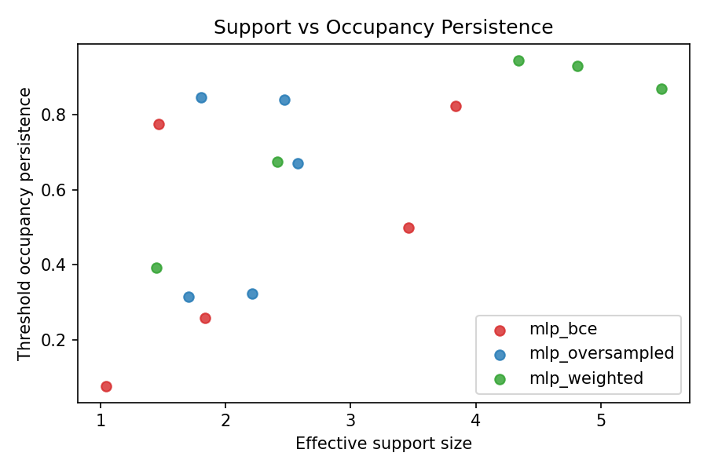
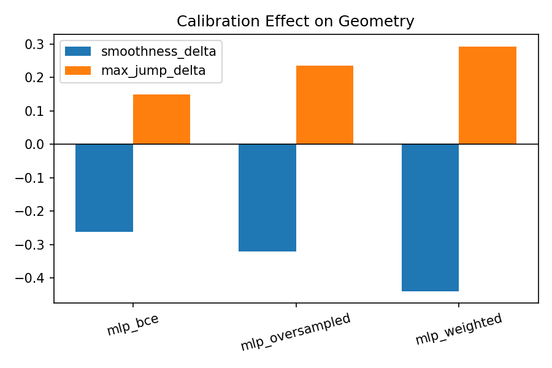

# Beyond AUROC and Calibration: Operational Accessibility Trajectories Under Severe Class Imbalance

## Abstract

Severe class imbalance is common in threshold-mediated deployments such as triage, fraud review, and sparse-event surveillance, yet evaluation is often dominated by static ranking and reliability metrics. We analyze reachability trajectories, closely related to class-conditional coverage trajectories but used here as an operational accessibility object under severe imbalance, to characterize how minority access evolves as threshold policy changes. Using this lens, family-level evidence shows that AUROC, average precision, ECE, and Brier can be partially non-equivalent to threshold-mediated accessibility behavior in this setting. We then show that within a fixed MLP architecture, objective/sampling perturbations (`mlp_bce` vs `mlp_oversampled`/`mlp_weighted`) can move accessibility morphology from cliff-like to smoother forms. We also observe a calibration interaction: reliability metrics can improve while operational smoothness declines and jump intensity increases in this constrained severe-imbalance regime. We present these results as an empirical + conceptual framing contribution rather than a complete theory or universal taxonomy. This manuscript is not a new learner, not a complete operational morphology theory, not a universal classifier taxonomy, and not a benchmark competition paper.

## 1. Introduction

How should we reason about operational accessibility under severe class imbalance? In many real systems, decisions are threshold-mediated rather than rank-only: teams tighten or relax thresholds to manage review load, precision constraints, or policy shifts. In that context, the key deployment question is not only whether positives are ranked above negatives, but whether minority cases remain accessible as threshold policy changes.

Our empirical program repeatedly surfaced a consistent signal: ranking quality does not reliably determine threshold-level accessibility in severe-imbalance settings. In our MLP baseline analysis over `boundary`, `cam`, `compustat`, `oil`, and `satimage`, dataset-mean values show `auroc_mean=0.7068` and `average_precision_mean=0.2410`, while `recall@0.50=0.1346` and `recall@0.01=0.7867` (recovery `+0.6522`) [source: `reports/neural_mlp_allocation_geometry_summary.md`]. On several severe datasets in the same run, default-threshold recall collapses near zero while low-threshold recovery remains substantial.

This signal is not restricted to neural learners. Under the same protocol, recurring accessibility structures appear across CART, HDDT, Bagged HDDT, Random Forest, LightGBM, and MLP-family models: some families show conservative or quantized accessibility, while others show cliff-like or broad recovery profiles. We therefore treat family-level observations as a core empirical layer, with neural perturbation results used to extend and stress-test the same accessibility framing.

To study this behavior, we treat threshold-mediated accessibility trajectories as operationally relevant analytical objects. We use reachability trajectories, elasticity localization, and accessibility persistence (defined here as threshold-survival persistence across the operational threshold grid) together with operational smoothness to describe where accessibility is lost, where it recovers, and how controllable threshold policy appears under perturbation.

Our contributions are:

1. We provide evidence that, under severe class imbalance, ranking and calibration summaries can underdescribe threshold-mediated minority accessibility, including near-neighbor ranking cases (for example, Bagged HDDT vs LightGBM) with materially different accessibility geometry.
2. We contribute a trajectory-centric analytical lens (reachability, elasticity localization, persistence/smoothness) for operational accessibility assessment.
3. We show fixed-architecture MLP accessibility morphology shifts under imbalance-pressure perturbations (BCE vs oversampled/weighted).
4. We document a calibration interaction in which reliability gains can coexist with degraded operational smoothness in this setting.
5. We frame these as empirical and conceptual contributions with explicit non-claims on universality and theory completeness.

### Scope delimitations

This manuscript is:

- an empirical + conceptual framing paper,
- focused on severe imbalance and threshold-mediated deployment,
- based on constrained model and dataset slices.

This manuscript is not:

- a complete operational morphology theory,
- a universal classifier taxonomy,
- a formal topology paper,
- a benchmark leaderboard paper,
- a production-ready objective proposal.

## 2. Related Work

### 2.1 Severe Class Imbalance Learning

Severe class imbalance has long been studied through cost-sensitive learning, sampling/reweighting strategies, and imbalance-aware tree criteria. Foundational work includes cost-sensitive classification formulations [CITATION: Elkan 2001], synthetic minority over-sampling [CITATION: Chawla et al. 2002], and broad imbalance surveys [CITATION: He and Garcia 2009], [CITATION: Krawczyk 2016]. Class-weighting and reweighting are now standard components in both classical and neural pipelines [CITATION: Buda et al. 2018], [CITATION: Johnson and Khoshgoftaar 2019].

For Hellinger-based trees, the original HDDT line [CITATION: Cieslak and Chawla 2008] and later robustness/skew-insensitivity analysis [CITATION: Cieslak et al. 2012] motivate inclusion of HDDT-style families as strong rare-event baselines in our analysis.

HDDT was introduced to reduce class-skew sensitivity of conventional split criteria by using Hellinger distance at split selection, with explicit motivation in rare-event settings and strong empirical performance under imbalance [CITATION: Cieslak et al. 2012]. The current manuscript does not claim that prior HDDT work studied accessibility geometry. Instead, we revisit HDDT-family behavior through an operational accessibility lens to evaluate threshold-mediated minority access and policy controllability.

Our manuscript is directly situated in this setting and uses these core tools (weighting, oversampling, threshold-based evaluation). We do not propose a new learner; we analyze how minority accessibility behaves under threshold evolution in deployment-relevant conditions.

### 2.2 Evaluation Under Severe Imbalance

Imbalance evaluation is commonly anchored by ROC/AUROC and PR/AP analyses [CITATION: Davis and Goadrich 2006], [CITATION: Saito and Rehmsmeier 2015], often supplemented by threshold-specific confusion-matrix metrics. Operating-point analysis is well established in decision-oriented classification and cost-curve traditions [CITATION: Fawcett 2006], [CITATION: Drummond and Holte 2006]. These metrics remain valuable and are used throughout.

Our results do not dispute their usefulness; they suggest these summaries can be insufficient on their own for threshold-mediated deployment interpretation. In this setting, models with acceptable ranking quality can still show default-threshold accessibility collapse, with substantial recovery only under threshold relaxation.

### 2.3 Selective Prediction, Coverage, and Threshold Analysis

Our closest conceptual neighbors are reject-option classification, selective prediction, and risk-coverage analysis [CITATION: Chow 1970], [CITATION: El-Yaniv and Wiener 2010], [CITATION: Geifman and El-Yaniv 2017]. These traditions analyze confidence-thresholded action sets and risk/coverage behavior.

We explicitly acknowledge overlap. Reachability, as used here, is closely related to class-conditional coverage/threshold trajectory analysis (`R(t)=P(\hat p(x)\ge t\mid y=1)`). We therefore do not claim a wholly new mathematical object. Our emphasis differs in operational focus under severe imbalance: minority accessibility persistence, elasticity localization, and threshold-policy robustness.

### 2.4 Calibration, Decision Analysis, and Operational ML

Calibration literature has established post-hoc methods and reliability diagnostics such as Platt scaling, isotonic regression, ECE, and Brier score [CITATION: Platt 1999], [CITATION: Zadrozny and Elkan 2002], [CITATION: Niculescu-Mizil and Caruana 2005], [CITATION: Guo et al. 2017]. We rely on these tools, and calibration remains valuable for probability reliability.

Our contribution is not a new calibration method. We study calibration-accessibility interaction under severe imbalance, where reliability improvements can coexist with less smooth threshold-accessibility behavior.

Decision-theoretic classification and utility-sensitive thresholding emphasize threshold choice under asymmetric costs [CITATION: Elkan 2001], [CITATION: Fawcett 2006]. Operational ML traditions emphasize deployment constraints, system maintenance/monitoring risk, and human-in-the-loop workflow design in triage/review systems [CITATION: Sculley et al. 2015], [CITATION: Breck et al. 2017], [CITATION: Amershi et al. 2019]. Our perspective is complementary: instead of optimizing only a single operating point, we focus on accessibility evolution as thresholds move under workload and risk constraints.

### 2.5 Summary Positioning

This manuscript is most closely related to severe-imbalance evaluation, selective prediction/coverage analysis, threshold-sensitive decision analysis, calibration-for-decision discussions, and operational ML deployment thinking. We do not claim a new learner or complete theory. Instead, we contribute an empirical and operationally grounded synthesis showing that ranking quality, reliability quality, and threshold-mediated minority accessibility can be partially non-equivalent under severe imbalance.

## 3. Operational Accessibility Under Severe Imbalance

Under severe imbalance, deployment systems are often constrained by review capacity, cost asymmetry, and threshold policy. In these contexts, operationally relevant performance is not just class ordering but accessibility persistence: whether minority cases remain available to action as thresholds move.

This distinction matters because threshold policies are not static in practice. Teams tighten or relax thresholds due to queue pressure, precision constraints, policy updates, or incident response. If behavior is cliff-like, small policy changes can produce disproportionate accessibility shifts. If behavior is smoother, policy control is more stable.

We therefore use operational accessibility to refer to threshold-conditioned minority access, and treat ranking quality as necessary but insufficient for deployment interpretation.

Potential objection: “is this just threshold tuning?” Our answer is no in two senses. First, the object of study is trajectory shape, not only an optimized point. Second, models with similar ranking quality can produce sharply different accessibility trajectories, implying different policy controllability.

To anchor this framing, we provide a conceptual map from ranking/calibration summaries to threshold-mediated reachability and resulting accessibility persistence.

{ width=100% }

**Figure 0:** Operational accessibility lens.

## 4. Reachability and Threshold Accessibility

We define reachability as:

\[
R(t) = P(\hat{p}(x) \ge t \mid y=1)
\]

where `t` is a decision threshold and `\hat{p}(x)` is the model score interpreted on `[0,1]`.

Intuitively, `R(t)` answers: what fraction of minority instances remains operationally accessible at threshold `t`?

Recall at a fixed threshold is one point on `R(t)`. Reachability analysis studies trajectory behavior across thresholds, including:

- where accessibility loss concentrates,
- how quickly accessibility decays,
- whether transition behavior is smooth or phase-like,
- how stable threshold-policy control is under perturbation.

This lens is closely related to class-conditional coverage trajectories, but we use it here as an operational deployment object centered on threshold-survival accessibility persistence, operational smoothness, and elasticity localization under severe imbalance.

Metric semantics used throughout this manuscript are as follows: "accessibility persistence" refers to threshold-survival persistence (occupancy/reachability survival across the threshold grid), while low-score mass concentration (`<0.01`) is treated as a separate secondary descriptor.

In this project, threshold grid analyses (`0.50`, `0.25`, `0.10`, `0.05`, `0.01`) and interval derivatives reveal patterns that single-threshold recall cannot. In transition artifacts, the BCE baseline MLP (formally introduced in Section 5 as `mlp_bce`) often concentrates reachability gains in narrow intervals (e.g., strong `0.50->0.25` jump on `boundary`; large `0.05->0.01` jump on `compustat`), while perturbed variants distribute gains more broadly [source: `results/geometry_transition_analysis/reachability_derivatives.csv`].

To understand threshold-mediated accessibility evolution, we first examine aggregate reachability trajectories.

{ width=100% }

**Figure 1:** Mean reachability transition.

To evaluate whether the aggregate pattern is stable or dataset-specific, we then inspect per-dataset reachability panels.

{ width=100% }

**Figure 2:** Dataset-level reachability panels.

Operational implication: same-threshold recall values can conceal very different threshold sensitivity structures.

A useful counterexample is `oil`, which shows a near-flat reachability pattern across thresholds and across MLP variants in current panels. This observationally suggests that threshold policy can be comparatively inert in some regimes, and that accessibility geometry itself is dataset-dependent rather than uniformly high-sensitivity.

## 5. Experimental Framework

We use a constrained, reproducible framework built around repeated splits, fixed threshold sweeps, and shared metric/reporting pathways.

### Data and protocol

- Legacy severe-imbalance datasets emphasized in this paper: `boundary`, `cam`, `compustat`, `oil`, `satimage`.
- Repeated split style follows project legacy protocol (5 repeated splits used in current reports).
- Operational thresholds: `0.50`, `0.25`, `0.10`, `0.05`, `0.01`.

### Model slices used in manuscript argument

- Baseline family comparators: CART, HDDT variants, RandomForest, XGBoost, LightGBM.
- The implementation identifier `hddt_forest` refers to the Bagged HDDT model throughout the manuscript.
- HDDT-family models were included because they were specifically designed for skew-insensitive learning under severe imbalance and therefore provide a natural comparison point for accessibility-oriented evaluation.
- Neural extension: MLP baseline (`mlp`).
- Fixed-architecture perturbation: `mlp_bce`, `mlp_oversampled`, `mlp_weighted`.

### Analysis artifact families

- threshold sweep summaries,
- elasticity summaries,
- allocation concentration summaries,
- occupancy summaries,
- calibration interaction summaries,
- recurring-pattern synthesis outputs.

This is intentionally not a broad architecture benchmark. No new deep-learning stack, neural architecture zoo, or hyperparameter sweep campaign is required for the claims developed here.

## 6. Accessibility Trajectory Observations

The first empirical layer is ranking-accessibility divergence under threshold evolution.

From the MLP baseline report, dataset-mean ranking quality is moderate (`auroc_mean=0.7068`, `average_precision_mean=0.2410`), but default-threshold accessibility is low (`recall@0.50=0.1346`) with strong recovery under relaxation (`recall@0.01=0.7867`) [source: `reports/neural_mlp_allocation_geometry_summary.md`]. At dataset level, severe collapse cases appear (`boundary=0.0000`, `compustat=0.0000` at `0.50`) with large recovery under lower thresholds.

These observations are consistent with earlier model-family findings: high AUROC/AP can coexist with near-zero minority accessibility at operational defaults.

To ground the non-equivalence claim with concrete anchors, we next present representative threshold-collapse and recovery values.

| model_id | AUROC | Average Precision | Recall@0.50 | Recall@0.01 | Recovery | Operational Smoothness | Max Recall Jump | Recurring Pattern |
| --- | ---: | ---: | ---: | ---: | ---: | ---: | ---: | --- |
| mlp_bce | 0.7068 | 0.2410 | 0.1346 | 0.7867 | 0.6522 | 0.4178 | 0.4061 | cliff_allocator |
| mlp_oversampled | 0.8351 | 0.2989 | 0.4973 | 0.7041 | 0.2067 | 0.5391 | 0.0678 | smooth_allocator |
| mlp_weighted | 0.7732 | 0.2658 | 0.5789 | 0.8506 | 0.2717 | 0.6080 | 0.1783 | smooth_allocator |
| xgboost | 0.8010 | 0.3090 | 0.1209 | 0.9854 | 0.8645 | 0.1753 | 0.4887 | cliff_allocator |
| hddt | 0.7810 | 0.2465 | 0.2909 | 0.8518 | 0.5609 | 0.2353 | 0.2690 | broad_allocator |

Sources:

- MLP perturbation variants: `reports/neural_mlp_objective_perturbation_summary.md`, `reports/neural_mlp_objective_perturbation/legacy_benchmark_summary.csv`, `reports/neural_mlp_objective_perturbation/legacy_threshold_sweep_summary.csv`, `results/geometry_transition_analysis/geometry_transition_model_means.csv`
- XGBoost/HDDT anchors: `reports/neural_mlp/legacy_benchmark_summary.csv`, `reports/neural_mlp/legacy_threshold_sweep_summary.csv`, `reports/neural_mlp/allocation_regime_summary.csv`

Notes:

- `Recovery = Recall@0.01 - Recall@0.50`.
- Values are dataset means over the severe-imbalance slice used in manuscript v0.3.

**Table 1:** Ranking vs accessibility anchors.

To establish that accessibility morphology appears before neural perturbation analysis, we next summarize family-level operational behavior under the same protocol.

| Model | AUROC | Average Precision | Recall@0.50 | Recall@0.01 | Recovery | Threshold Occupancy Persistence | Operational Smoothness | Max Recall Jump | Recurring Pattern | Low-Score Mass (<0.01) |
| --- | ---: | ---: | ---: | ---: | ---: | ---: | ---: | ---: | --- | ---: |
| CART | 0.6249 | 0.1458 | 0.2910 | 0.2910 | 0.0000 | 0.2910 | 1.0000 | 0.0000 | quantized_allocator | 0.9429 |
| HDDT | 0.7810 | 0.2465 | 0.2909 | 0.8518 | 0.5609 | 0.5006 | 0.2353 | 0.2690 | broad_allocator | 0.5181 |
| Bagged HDDT (hddt_forest) | 0.8389 | 0.3434 | 0.0954 | 0.9978 | 0.9024 | 0.5397 | 0.1741 | 0.6100 | cliff_allocator | 0.1252 |
| Random Forest | 0.8176 | 0.3573 | 0.1531 | 0.9109 | 0.7578 | 0.5597 | 0.2249 | 0.3458 | broad_allocator | 0.4275 |
| XGBoost | 0.8010 | 0.3090 | 0.1209 | 0.9854 | 0.8645 | 0.4915 | 0.1753 | 0.4887 | cliff_allocator | 0.2032 |
| LightGBM | 0.8479 | 0.3462 | 0.2026 | 0.7511 | 0.5485 | 0.4413 | 0.2624 | 0.2218 | conservative_allocator | 0.6753 |
| MLP | 0.7068 | 0.2410 | 0.1346 | 0.7867 | 0.6522 | 0.4868 | 0.4178 | 0.4061 | cliff_allocator | 0.4086 |

Sources:

- `reports/neural_mlp/legacy_benchmark_summary.csv`
- `reports/neural_mlp/legacy_threshold_sweep_summary.csv`
- `reports/neural_mlp/prediction_space_occupancy_summary.csv`
- `reports/neural_mlp/allocation_regime_summary.csv`

Definitions:

- `Recovery = Recall@0.01 - Recall@0.50`.
- `Threshold Occupancy Persistence` = model-level mean of `threshold_occupancy_persistence_mean` across datasets.
- `Low-Score Mass (<0.01)` = `mean_fraction_below_0_01` (kept as secondary concentration descriptor).

**Table A (v2):** Allocator family summary with threshold-survival persistence.

**Running Example: Similar Ranking, Different Accessibility (Bagged HDDT vs LightGBM).**
Bagged HDDT and LightGBM are near-neighbors on ranking quality (`AUROC 0.8389` vs `0.8479`; `AP 0.3434` vs `0.3462`), but they diverge on accessibility geometry. Bagged HDDT shows much higher recovery (`0.9024` vs `0.5485`) and jump intensity (`0.6100` vs `0.2218`), with lower smoothness (`0.1741` vs `0.2624`). Persistence is also higher for Bagged HDDT (`0.5397` vs `0.4413`), with stability analyses indicating strong directional robustness under current resampling and a smaller, qualified persistence-strength interpretation versus some comparators. This anchor illustrates the central point: similar ranking summaries do not imply similar threshold-policy controllability.

To probe cliff-versus-broad separation directly, we inspect jump-persistence geometry as the primary regime map in the main text.

{ width=100% }

**Figure 7:** Accessibility regime map (max jump vs threshold-survival persistence).

Complementary regime views (smoothness vs persistence and recovery vs persistence) are consistent with this pattern and are recommended for appendix placement in external-review packages.

Potential objection: “are these isolated examples?” We mitigate that concern by repeated-split summaries and multi-dataset consistency in severe subsets, while treating generalization as bounded.

### Stability of Accessibility Geometry

We performed a dataset-resampling stability analysis using bootstrap (`n=10000`, seed `7`) and leave-one-dataset-out sensitivity on the severe benchmark slice (`boundary`, `cam`, `compustat`, `oil`, `satimage`) [source: `reports/neural_mlp/bagged_hddt_stability_summary.md`]. For Bagged HDDT relative to HDDT and LightGBM, recovery uplift and max-jump uplift remain stable under current resampling. The lower-smoothness profile is also directionally stable under current resampling. Threshold-survival persistence uplift is positive but smaller against HDDT (`+0.0388` mean delta, qualified) and stronger against LightGBM (`+0.0985` mean delta).

These results support describing the Bagged HDDT accessibility profile as an empirically stable phenomenon under current resampling rather than a single-dataset artifact, while keeping persistence-strength claims conservative.

## 7. Recurring Morphology Patterns (Provisional)

After trajectory evidence is established, recurring empirical patterns become useful shorthand. We use descriptors such as quantized, cliff-like, smooth, broad, and conservative to summarize recurring behavior; we do not treat these as formal classes.

In baseline analyses, CART often aligns with quantized behavior (minimal threshold response), XGBoost is consistently cliff-like in current evidence, LightGBM appears conservative in the cited runs, and HDDT/Bagged HDDT often align with broader accessibility patterns. For Bagged HDDT specifically, this should be read as an empirically stable phenomenon under current resampling rather than an isolated anomaly. These labels remain provisional empirical organization.

To localize where threshold sensitivity concentrates, we summarize interval-level elasticity patterns.

{ width=100% }

**Figure 3:** Elasticity interval concentration heatmap used as recurring-pattern evidence rather than taxonomy proof.

Reviewer-facing caveat: these recurring patterns are intended as empirical shorthand, not formal ontology; their expression is threshold-grid dependent and dataset-conditional.

## 8. Neural Perturbation and Morphology Transition

This section provides a key inferential pivot: with architecture held fixed, imbalance-pressure perturbation changes accessibility morphology.

From the perturbation summary (dataset means):

- `mlp_bce`: `AUROC=0.7068`, `AP=0.2410`, `recall@0.50=0.1346`, `recall@0.01=0.7867`, `operational_smoothness=0.4178`, `max_recall_jump=0.4061`, recurring pattern `cliff_allocator`.
- `mlp_oversampled`: `AUROC=0.8351`, `AP=0.2989`, `recall@0.50=0.4973`, `recall@0.01=0.7041`, `operational_smoothness=0.5391`, `max_recall_jump=0.0678`, recurring pattern `smooth_allocator`.
- `mlp_weighted`: `AUROC=0.7732`, `AP=0.2658`, `recall@0.50=0.5789`, `recall@0.01=0.8506`, `operational_smoothness=0.6080`, `max_recall_jump=0.1783`, recurring pattern `smooth_allocator`.

These shifts are consistent with imbalance-pressure sensitivity and support the claim that operational accessibility is not architecture-only.

To interpret mechanism-level structure, we next contrast support breadth with occupancy persistence.

{ width=100% }

**Figure 4:** Support vs persistence scatter.

Interpretive nuance from transition analysis: operational smoothness is not reducible to support breadth alone. `mlp_weighted` broadens support more strongly, but `mlp_oversampled` also smooths trajectories without equivalent support expansion. This is consistent with threshold-morphology redistribution as a primary mechanism.

Potential objection: “does oversampling merely shift thresholds?” Current interval-derivative evidence suggests a stronger interpretation than pure translation: dominant jump intervals shift across variants, cliff behavior narrows in some settings rather than moving uniformly, accessibility gains redistribute across threshold bands, and elasticity concentration becomes less localized. This pattern is consistent with morphology change, not only threshold offset.

## 9. Calibration vs Operational Accessibility

Practical implication: reliability and accessibility are distinct operational axes. In threshold-mediated deployment, teams can improve reliability summaries while unintentionally increasing threshold sensitivity and reducing accessibility controllability.

This section consolidates that finding by linking calibration improvements to accessibility-geometry shifts.

Across MLP perturbation variants, calibration summaries indicate ECE/Brier improvements, while transition deltas show negative smoothness shifts and positive jump shifts on average [source: `results/geometry_transition_analysis/calibration_transition_model_means.csv`]. In recurring-pattern persistence artifacts, `mlp_oversampled` and `mlp_weighted` can appear smooth in raw form but cliff-like after calibration transforms [source: `reports/neural_mlp_objective_perturbation/calibration_interaction/regime_persistence_table.csv`].

Before reading Figure 5, the expected pattern is: reliability improves, smoothness declines, jump intensity rises, and practical threshold sensitivity worsens in the same constrained setting.

Reliability and accessibility appear to be partially non-equivalent operational axes in this severe-imbalance setting. Calibration remains valuable for probability reliability; the point is that reliability gains do not guarantee preservation of accessibility persistence or operational smoothness.

To make this interaction explicit, we next examine calibration geometry deltas.

{ width=100% }

**Figure 5:** Calibration geometry deltas.

Potential objection: “is this just calibration pathology in one setup?” We treat this as bounded evidence requiring replication across calibrators and data regimes, not a universal anti-calibration claim.

## 10. Toward Operational Morphology

Current evidence supports four points. First, operational accessibility trajectories deserve direct analysis under severe imbalance. Second, recurring empirical patterns can summarize behavior when treated as provisional shorthand. Third, fixed-architecture perturbation results suggest imbalance-pressure mechanisms can materially alter behavior. Fourth, calibration-quality improvements can coexist with accessibility degradation.

Taken together, these findings support a synthesis in which ranking quality, calibration quality, and accessibility behavior are separate but interacting views of model behavior in threshold-mediated deployment.

The stability analysis suggests that these effects are not driven by any single dataset in the current benchmark collection. At the same time, additional datasets are needed to test external validity beyond this constrained severe-imbalance slice.

Why should deployment teams care? In queue-managed review systems and human-in-the-loop triage, threshold policy is often a control knob. If accessibility behavior is cliff-like, small threshold moves can trigger large changes in minority access and workload composition. If behavior is smoother and persistence is higher, teams gain more stable control under policy adjustments. A trajectory-aware view therefore improves operational risk interpretation even when ranking and reliability summaries look acceptable.

We present operational morphology as an emerging framing perspective, not a complete formal theory. The intent is to improve deployment interpretability, sharpen hypothesis generation, and structure follow-up studies without overclaiming.

## 11. Limitations

This draft has clear limitations.

1. **Dataset scope:** evidence comes from a constrained severe-imbalance legacy slice; external validity is unproven.
2. **Threshold grid dependence:** analyses use a fixed threshold set; finer grids may alter localization details.
3. **Terminology overlap risk:** reachability partially overlaps with selective prediction/class-conditional coverage traditions.
4. **Provisional labels:** recurring-pattern labels are heuristic shorthand, not formal ontology.
5. **Neural scope:** only sklearn-style MLP baseline and perturbations are included.
6. **Mechanism uncertainty:** bagged HDDT broad behavior is empirically visible but mechanistically unresolved.
7. **Calibration interaction uncertainty:** observed reliability-smoothness divergence may vary by calibrator/data scale.
8. **No formal theory claims:** the manuscript does not provide complete theoretical characterization or causal proof.

Accordingly, we do not claim universal behavior, complete morphology characterization, or definitive causal decomposition.

## 12. Future Work

We prioritize bounded extensions aligned to current evidence strength.

1. **Bagged HDDT mechanism disambiguation:** separate effects of Hellinger splitting, bagging stabilization, and feature/subsample structure using explicit vote-dispersion diagnostics, bagging-effect decomposition, and ensemble accessibility geometry analysis.
2. **Calibration-morphology decomposition:** characterize when reliability correction re-steepens accessibility and when it does not.
3. **Reachability-aware objective exploration (cautious):** investigate whether trajectory-aware training pressure can improve operational controllability without overfitting threshold grids.
4. **Cross-domain replication:** test whether trajectory non-equivalence patterns hold in additional imbalance domains.

These are hypothesis-generating directions, not validated solutions.

## 13. Conclusion

In threshold-mediated severe-imbalance settings such as those studied here, operational accessibility should be analyzed as a first-class empirical object alongside ranking and reliability summaries. Current evidence suggests that static AUROC/AP and calibration metrics can underdescribe trajectory behavior that is operationally consequential. Reachability trajectories, elasticity localization, accessibility persistence, and operational smoothness provide a practical lens for this analysis.

Empirically, fixed-architecture MLP perturbations (`mlp_bce` vs `mlp_oversampled`/`mlp_weighted`) show cliff-to-smoother recurring-pattern transitions, supporting the view that accessibility morphology is sensitive to imbalance-pressure mechanisms rather than architecture alone. Calibration results further indicate that reliability gains can coexist with degraded accessibility smoothness in this setting, reinforcing that reliability and accessibility are partially non-equivalent operational axes.

This trajectory lens is closely related to class-conditional coverage analysis but emphasizes operational accessibility persistence and smoothness under threshold policy change. We present this work as an empirical + conceptual framing contribution, not a new learner, not a complete operational morphology theory, not a universal classifier taxonomy, and not a universal anti-calibration claim.

A natural next step is targeted replication and mechanism disambiguation across broader datasets, calibrators, and model families to determine when these recurring patterns persist and when they break.
